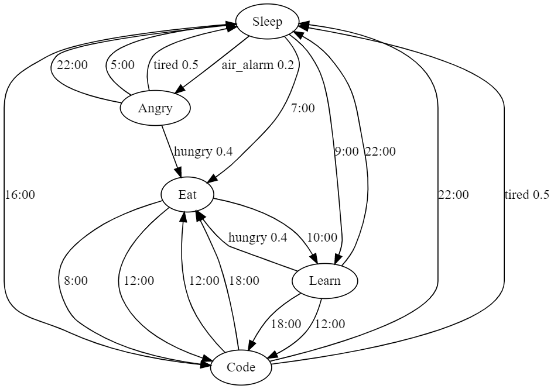

# dm2-lab3

## Description

This is simple **FSM**(Finite State Machine) implementation in Python that represents my usual day.

## How to use
You just have to run `main.py` file and follow the instructions.
```bash
python3 main.py
```

## Example of output
```
I am Sleeping 
I'm Angry! Air Alarm!
Eating I'm hungry now!
Learning
Learning
Learning
Learning
Learning
Learning
Learning
Learning
Learning
Coding
Coding
Coding
Coding
I am Sleeping I'm so tired!
I am Sleeping
I am Sleeping
I am Sleeping
I am Sleeping
I am Sleeping
I am Sleeping
I'm Angry! Air Alarm!
```

## Automat diagram


## License
[MIT](https://choosealicense.com/licenses/mit/)
